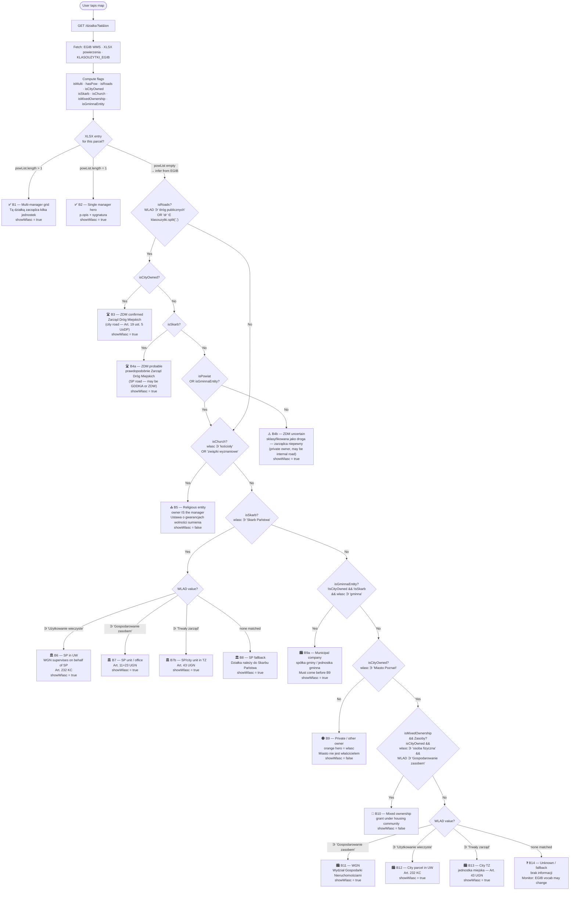

# Parcel Logic Tree

How `buildCard()` decides what to display when a user taps the map.
Source: [`index.html:431–540`](index.html).

---

## Viewing this diagram

| Tool | How |
|---|---|
| **GitHub** | Push the file — renders automatically in the repo browser |
| **VS Code** | Install [Markdown Preview Mermaid Support](https://marketplace.visualstudio.com/items?itemName=bierner.markdown-mermaid), then `Cmd+Shift+V` |
| **Browser** | Paste the code block below into [mermaid.live](https://mermaid.live) |
| **Obsidian** | Opens natively — no plugin needed |

---

## Decision tree

---

## Panel output zones

Every branch renders the same three zones:

| Zone | Content | When hidden |
|---|---|---|
| **Hero** | Manager name (blue) or owner name (orange for B9) + contextual note | Never |
| **Data grid** | Numer działki · Właściciel · Powierzchnia | Właściciel hidden when `showWlasc = false` |
| **Rodzaj powierzenia** | Raw WLAD value | Hidden when WLAD is empty or `"—"` |

`showWlasc = false` in B5, B9, B10 — the owner name is already shown in the hero zone.
